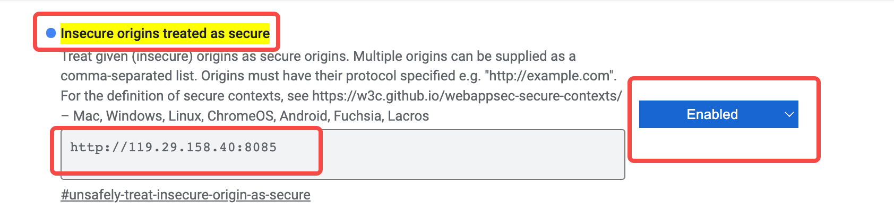

# 猫头鹰助理

## Build Setup

# 下载依赖
前端： npm install 或 yarn install (推荐)
后端： JDK 17

# 运行项目
前端： npm run dev
后端： 运行 OwlAssistantEndApplication

浏览器访问 localhost:8085 即可
工号：2019
密码：123

# 运行说明
电脑要能支持语音录入（台式机没有外设的需要插入耳机，不然无法运行）
我们已经利用云服务器做了部署，但是由于域名备案中，目前只能使用 http://119.91.99.211:8085 访问，请务必看下文后再操作。
由于chrome浏览器禁止了http使用录音机，因此体验前请先根据以下指引开启录音机权限：

step1: 使用chrome打开chrome://flags/#unsafely-treat-insecure-origin-as-secure

step2: 找到Insecure origins treated as secure项

step3: 输入http://119.29.158.40:8085，并改为enabled，如下图

step4: 点击页面底部的Relaunch按钮生效

step5: 访问http://119.91.99.211:8085即可

